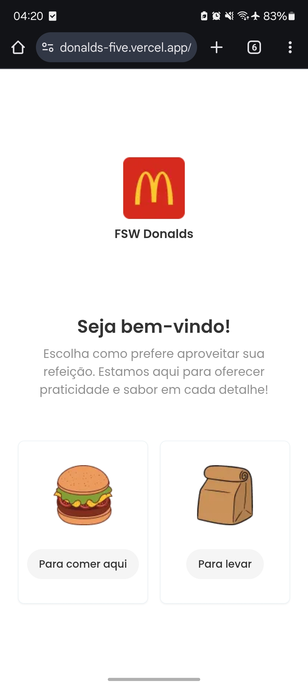
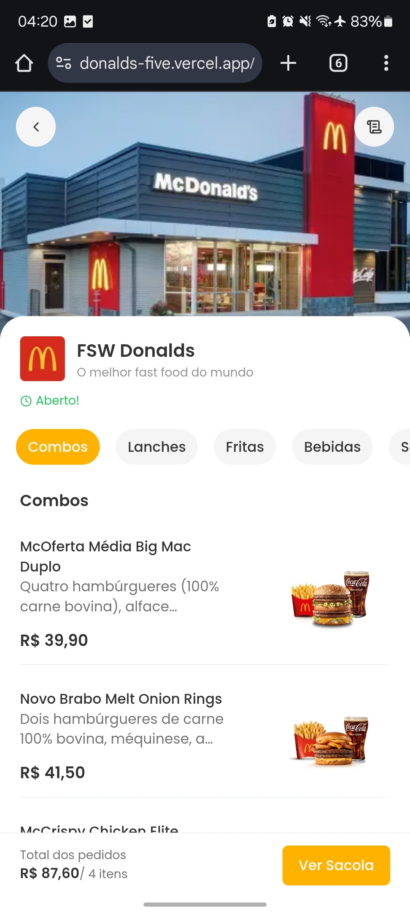
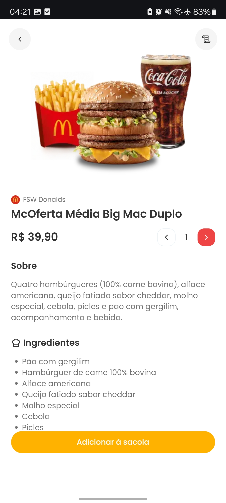
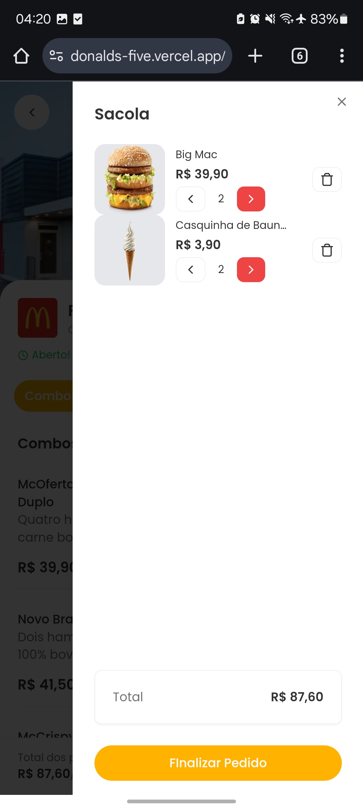
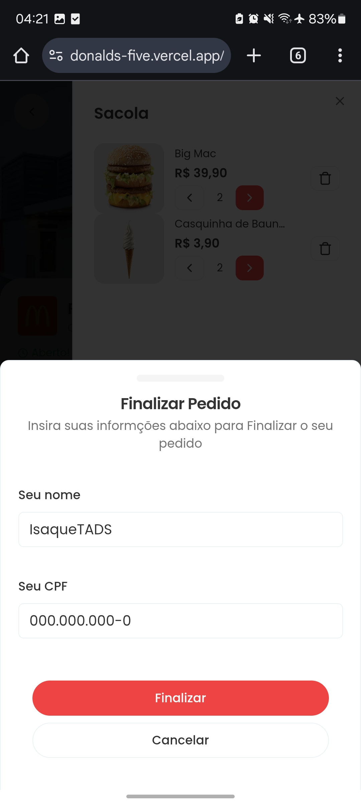
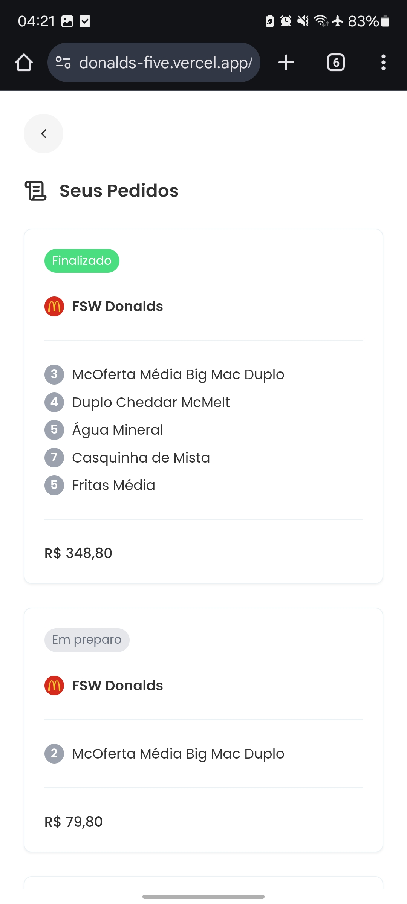
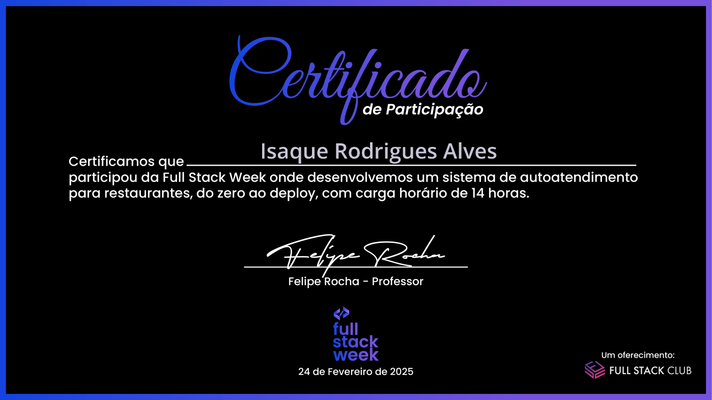

# 🍔 FSW Donalds - Sistema de Autoatendimento
**Projeto desenvolvido durante a 7ª edição da Full Stack Week** promovida pelo Full Stack Club!  
Uma aplicação de autoatendimento inspirada no sistema de pedidos de restaurantes fast-food.

[](https://donalds-five.vercel.app/fsw-donalds)


## 👨‍💻 Sobre o Desenvolvedor

<div align="center">
  
</div>

**Isaque Rodrigues**  
🎓 Estudante de Análise e Desenvolvimento de Sistemas | IFNMG  
🚀 Desenvolvedor Full Stack com foco em:

<div style="display: flex; gap: 10px; flex-wrap: wrap; justify-content: center;">
  
  
  
  
  
  
</div>

<br/>

📍 Minas Gerais | [LinkedIn](https://www.linkedin.com/in/isaque-rodriguestads) | [GitHub](https://github.com/IsaqueTADS)

## 📋 Sobre o Projeto

Projeto desenvolvido durante a **7ª edição da Full Stack Week** promovida pelo [Full Stack Club](https://www.youtube.com/@dicasparadevs).

**FSW Donalds** é uma aplicação completa de autoatendimento inspirada em sistemas de fast-food, com:

- 🖥️ Interface intuitiva para clientes
- 🛒 Sistema de carrinho dinâmico
- 📱 Design responsivo
- 🚀 Tecnologias modernas do ecossistema JavaScript

🔗 **Acesso ao Projeto:** [Clique aqui para ver ao vivo](https://donalds-five.vercel.app/fsw-donalds)


```bash
# Clone o repositório
git clone https://github.com/IsaqueTADS/Donalds.git  

# Acesse a pasta
cd fsw-donalds

# Instale as dependências
npm install

# Rode o projeto
npm run dev

```

## 🚀 Tecnologias Utilizadas

| Tecnologia | Badge |
|------------|-------|
| Next.js 15 (App Router) |  |
| React 19 |  |
| Tailwind CSS |  |
| Prisma ORM |  |
| PostgreSQL |  |
| Radix UI |  |
| Lucide Icons |  |
| React Hook Form + Zod |  |


## 📸 Prints do Projeto

<p align="center">
  
  
  
</p>

<p align="center">
  
  
  


<br/>
## 📜 Certificado de Participação
<br/>

<div align="center">
  
  <p><em>Certificado oficial de participação no evento Full Stack Week</em></p>
</div>